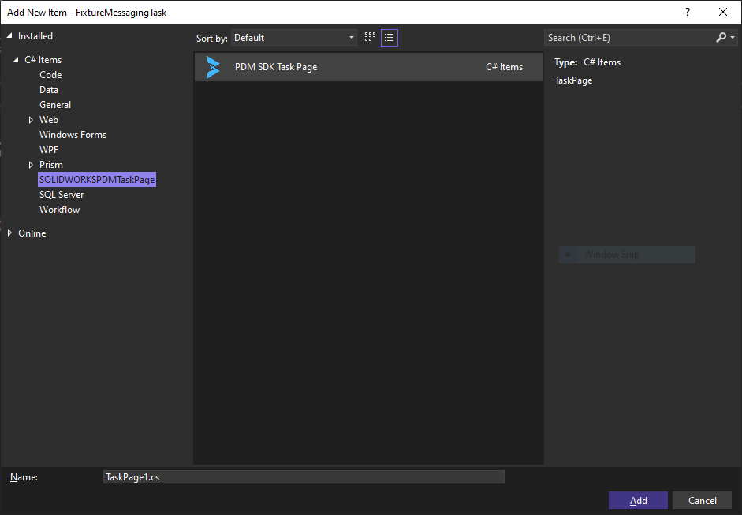

# Definition

The task setup hook gets triggered when you select the add-in from the dropdown in the task dialog or you edit an add-in's task.

The task setup hook allows you to load and save data into the task. It also gives the ability to add custom tabs to the task setup dialog. This tabs are WinForms UserControls.

# IEdmTaskProperties object

You may need, depending on your OnCmd implementation, to access the task properties. 

In PDMSDK, use base.Properties to get access to the IEdmTaskProperties property. This property returns null or nothing in hooks other than EdmTaskSetup and EdmTaskSetupButton.


# Creating an EdmTaskPage

>[!TIP]
> If your task does not have any settings, you can completely ignore the EdmTaskSetup hook. There is no need to store data in the task.

Consult the [Task Sample](https://help.solidworks.com/2017/english/api/epdmapi/TaskSample.htm) from the SOLIDWORKS PDM Professional API help to see the default implementation of this hook. 

We highly recommend you use PDMSDK's because it saves a lot of time.

You can add one of many custom tabs. In PDMSDK terminology, we call them task page. A task page is presented by the type EdmTaskPage.

You need to be aware of two types: 

- EdmTaskPage: It is a generic wrapper around the WinForms UserControl with built-in support for saving and loading data in the task. The data is serialized and deserialized. The data object must be a serialized class. the EdmTaskPage takes care of creating or loading an instance of your data class as well as saving into the task. Your data object is property called ViewModel in the EdmTaskPage.

- ITaskPage: An interface that the EdmTaskPage implements. 

>[!TIP]
> We highly recommend you use the PDMSDK Visual Studio Template because it comes ready with a boilerplate EdmTaskPage item to be added to your project.


To add an EdmTaskSetup:

- Right-click on the *Project* in the *Solution Explorer* and click Add *New Item...*


- Look for EdmTaskPage, give it a new and click *Add*. 



- By default, two items are added: The EdmTaskPage and the data object which is called EdmTaskPageViewModel. In the example below, the page is called `Messaging`.


- An EdmTaskPage is a WinForms UserControl. You can use the Visual Studio Toolbox to add and remove WinForms controls to and from it.
- Requirement: In the OnDataLoaded method in the EdmTaskPage, you can bind your the data object properties to the controls in the EdmTaskPage.

# Adding a new task page

In the OnCmd implementation:

- Create instances of your task pages.
- Set the [Container](../api/BlueByte.SOLIDWORKS.PDMProfessional.SDK.Core.TaskPage-1.html#BlueByte_SOLIDWORKS_PDMProfessional_SDK_Core_TaskPage_1_Container) property in the EdmTaskPage to that of the AddInBase. We're passing the Container from the AddInBase to the EdmTaskPage.
- Set the Name property of the EdmTaskPage. You can also do this in the constructor.
- Call the method [AddTaskSetupPages](../api/BlueByte.SOLIDWORKS.PDMProfessional.SDK.AddInBase.html#BlueByte_SOLIDWORKS_PDMProfessional_SDK_AddInBase_AddTaskSetupPages_BlueByte_SOLIDWORKS_PDMProfessional_SDK_Core_ITaskPage___)  and supply it with an array of your task pages.


# Saving task page's data

>[!WARNING]
> You must reuse the same instance from the TaskSetup hook.

- Call the method StoreData in your EdmTaskPage.
- You may also call AddContextMenu to add a right-click that triggers the task launch from File Explorer if the task flags allow that.


See the complete code example below.

# Example


# [C Sharp](#tab/cs)
```
Pages.Messaging taskSetupMessagingTab = default(Pages.Messaging);
       
        public override void OnCmd(ref EdmCmd poCmd, ref EdmCmdData[] ppoData)
        {
            base.OnCmd(ref poCmd, ref ppoData);

            try
            {
                switch (poCmd.meCmdType)
                {
                    
                    case EdmCmdType.EdmCmd_TaskSetup:
                        {
                            taskSetupMessagingTab = new Pages.Messaging();
                            taskSetupMessagingTab.Name = "Messaging";
                            taskSetupMessagingTab.Container = base.Container;
                            AddTaskSetupPage(taskSetupMessagingTab);
                            // or if you have multiple pages
                            // AddTaskSetupPages(new BlueByte.SOLIDWORKS.PDMProfessional.SDK.Core.ITaskPage[] {  taskSetupMessagingTab});

                        }
                        break;
                    case EdmCmdType.EdmCmd_TaskSetupButton:
                        {
                            // add a context menu 
                            AddContextMenu($"Tasks\\{Properties.TaskName} [V{Identity.Version}]", Identity.Description);
                            
                            // save the data of the tab
                            taskSetupMessagingTab.StoreData(ref poCmd);

                        }
                        break;
                    case EdmCmdType.EdmCmd_TaskDetails:
                        break;
                    case EdmCmdType.EdmCmd_TaskRun:
                        break;
                    case EdmCmdType.EdmCmd_TaskLaunch:
                        break;
                    case EdmCmdType.EdmCmd_TaskLaunchButton:
                    default:
                        break;
                }
            }
            catch (CancellationException e)
            {

                throw;
            }
            catch (TaskFailedException e)
            {

                throw;
            }
            // this is a PDM exception
            catch (COMException e)
            {

                throw;
            }
            catch (Exception e)
            {

                throw;
            }

        }
```
# [VB](#tab/VB)
```
 Private taskSetupMessagingTab As Pages.Messaging = Nothing

    Public Overrides Sub OnCmd(ByRef poCmd As EdmCmd, ByRef ppoData() As EdmCmdData)

        MyBase.OnCmd(poCmd, ppoData)

        Try
            Select Case poCmd.meCmdType
                Case EdmCmdType.EdmCmd_TaskSetup
                    taskSetupMessagingTab = New Pages.Messaging()
                    taskSetupMessagingTab.Name = "Messaging"
                    taskSetupMessagingTab.Container = MyBase.Container
                    AddTaskSetupPage(taskSetupMessagingTab)
                    ' Or if you have multiple pages
                    ' AddTaskSetupPages(New BlueByte.SOLIDWORKS.PDMProfessional.SDK.Core.ITaskPage() {taskSetupMessagingTab})

                Case EdmCmdType.EdmCmd_TaskSetupButton
                    ' Add a context menu
                    AddContextMenu($"Tasks\{Properties.TaskName} [V{Identity.Version}]", Identity.Description)

                    ' Save the data of the tab
                    taskSetupMessagingTab.StoreData(poCmd)

                Case EdmCmdType.EdmCmd_TaskDetails
                    ' Implement task details logic here

                Case EdmCmdType.EdmCmd_TaskRun
                    ' Implement task run logic here

                Case EdmCmdType.EdmCmd_TaskLaunch
                    ' Implement task launch logic here

                Case EdmCmdType.EdmCmd_TaskLaunchButton
                    ' Implement task launch button logic here

                Case Else
                    ' Default case logic

            End Select

        Catch e As CancellationException
            Throw

        Catch e As TaskFailedException
            Throw

        ' This is a PDM exception
        Catch e As COMException
            Throw

        Catch e As Exception
            Throw

        End Try

    End Sub
```
---

# Debugging 

>[!IMPORTANT]
> You cannot debug task setup pages with *Debug Add-ins...*


- Make sure you have a fresh connection to PDM. Generally speaking, this is done by killing Conisioadmin.exe, edmserver.exe and explorer.exe and then restarting explorer.exe. This process can be done from the Windows task manager.
- Call AttachDebugger in your OnCmd.
- Compile code.
- Add the project files to your vault from the administration tool. Right-click on *Add-ins* and click *New Add-in...*
- Accept all dialogs.
- Right-click on *Tasks* and click *New...*
- Choose the add-in that you just added from the dropdown.
- AttachDebugger will be called immediately and you can attach Visual Studio to start debugging through your code.


>[!TIP]
> You can use the directives #if DEBUG #endif to conditionally compile the AttachDebugger in the debug configuration. This will ignore it in the Release configuration which you can use in production. Be aware that release configurations do not automatically generate pdb files so your stack traces will not print in your error or logs.
