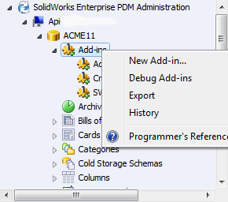

# Debugging Add-ins 

Add-ins are stored in the file vault and are downloaded to and COM-registered on the client computer when they are needed. This presents a problem when developing a new add-in that you want to debug, because the add-in is re-registered in a folder that is different than the compiler’s output folder. Testing an add-in in a production vault can also be a problem, because it affects all users of the vault.

SOLIDWORKS PDM Professional provides a menu command that solves these two problems, Debug Add-ins.

When an add-in is installed as a debug add-in, it is registered only on your machine. No other users are affected by it. The add-in is also loaded from the location where it is registered.

To debug an add-in using File Explorer:

- Open the Windows Task Manager.
- Kill the explorer.exe/edmserver.exe process.
- Right-click the project name in the Solution Explorer of Visual Studio and click Properties.
- Click the Debug tab.
- Click Start external program and type the File Explorer executable's path. For example:
C:\windows\notepad.exe
- Click Debug > Start Debugging.

# Limitations

Using notepad.exe as an external program has limitations:

- Open file dialog has no support for multi-select for files or folders
- Numerous steps required to be performed each time new debug session is started (i.e. click Open menu, navigate to vault, change filter). 
- You **cannot** use Debug Add-ins to debug task add-ins.

>[!TIP]
> We highly recommend you use our Console Debugger Tool for SOLIDWORKS PDM Professional add-ins. You can download the binaires from our release page in this [repo](https://github.com/AmenJlili/Console-debugger-tool-for-SOLIDWORKS-PDM-Professional-addins/releases). 

# PDMSDK's AttachDebugger

PDMSDK provides you with a built-in method in the base class called AttachDebugger that triggers the Visual Studio debugger to launch a window and asks which Visual Studio instance to use. 

All you need to do is: 

- Call AttachDebugger in your OnCmd method
- Load the add-in either by adding it through *New Add-in...* or *Debug Add-ins*
- Trigger the add-in to execute by invoking of the hook you are watching or invoking a command.
- The add-in will prompt the debug dialog. Click OK to start debugging...