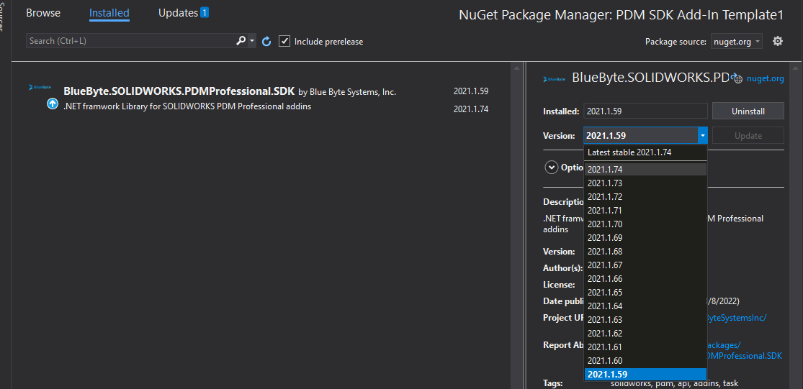

To fully utilize the latest features and bug fixes of the SDK, please make sure you are using the latest version of the BlueByte.PDMProfessional.SDK nuget package.

>[!NOTE]
> BlueByte.PDMProfessional.SDK targets .NET framework 4.7.2. For more information, check out the nuget package [page](https://www.nuget.org/packages/BlueByte.SOLIDWORKS.PDMProfessional.SDK).

The latest version of the nuget is:  [](https://www.nuget.org/packages/BlueByte.SOLIDWORKS.PDMProfessional.SDK)

# Using the Package Manager Console
In Visual Studio:
- Press Ctrl + Q. This is going to highlight the search box at the top of the window.
- Type Nuget Package Manager Console and pick the first search result.
- A new window will appear. Allow a couple of seconds for the package manager to initialize.
- Type in the following command (and press enter):

```Update-Package BlueByte.SOLIDWORKS.PDMProfessional.SDK```

- The command above will install the package in the active project. If you have multiple projects and you need to specify the one that needs to update the SDK nuget pacakge, use the ```-project``` argument to specify the project name. Example: ```Update-Package BlueByte.SOLIDWORKS.PDMProfessional.SDK -project MyAddInProject```

- The Package Manager Console will report back that package has been installed successfully. 

# Using the Package Manager
In Visual Studio, 
- Locate the add-in's project in the *Solution Explorer*
- Right-click on the project and click *Manage Nuget Packages...*
- The Package Manager window will open. Locate and select the BlueByte.SOLIDWORKS.PDMProfessional.SDK nuget package in the installed tab. 
- Depending on the version of the SDK template, you may be to update the package if there is a new version. If an update is available, select the nuget package. 
- The properties of the package will update on the right-side of the window and you are able to pick the latest available version from the version dropdown. 


